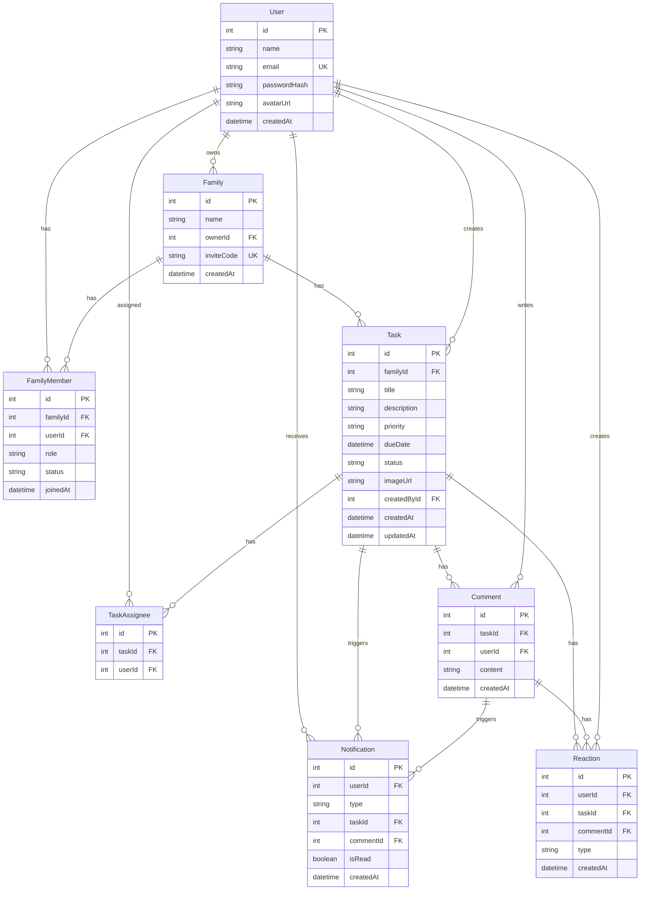
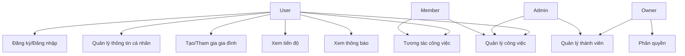
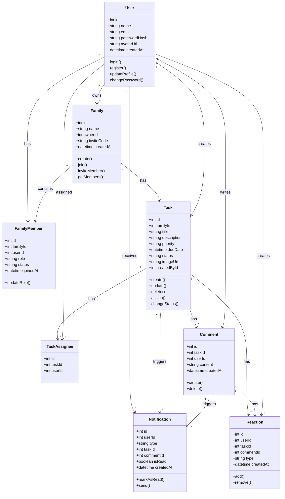
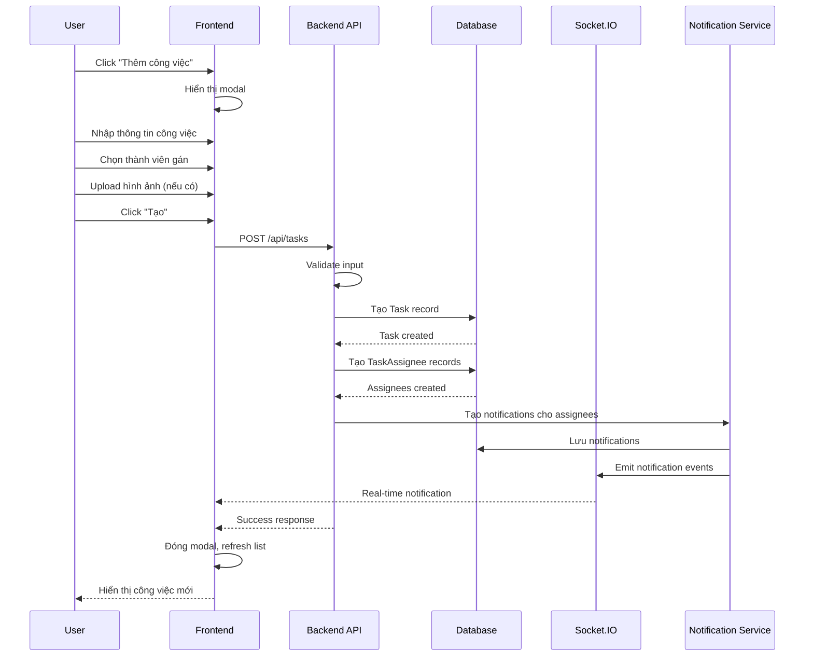
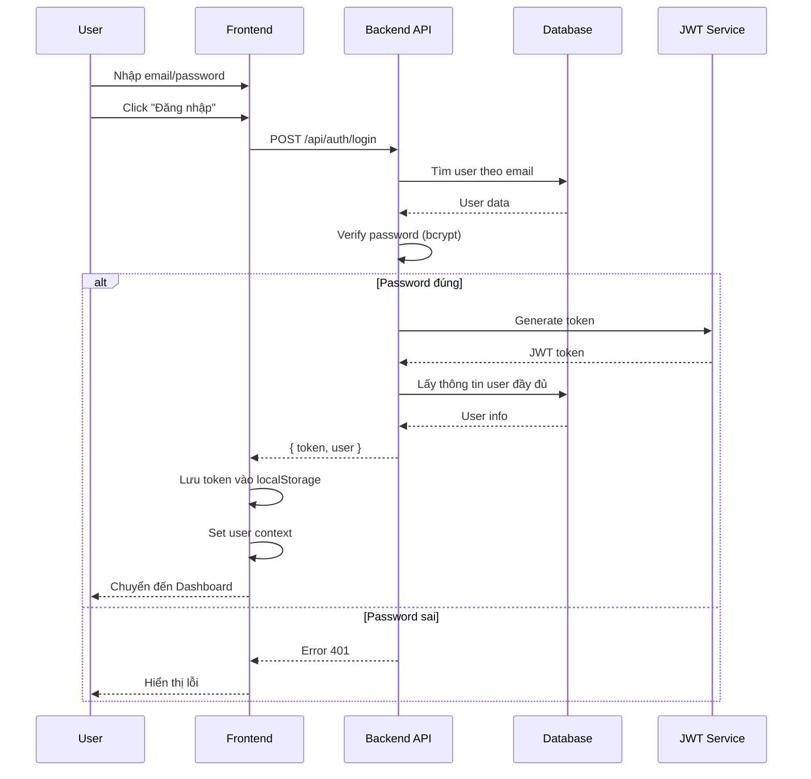
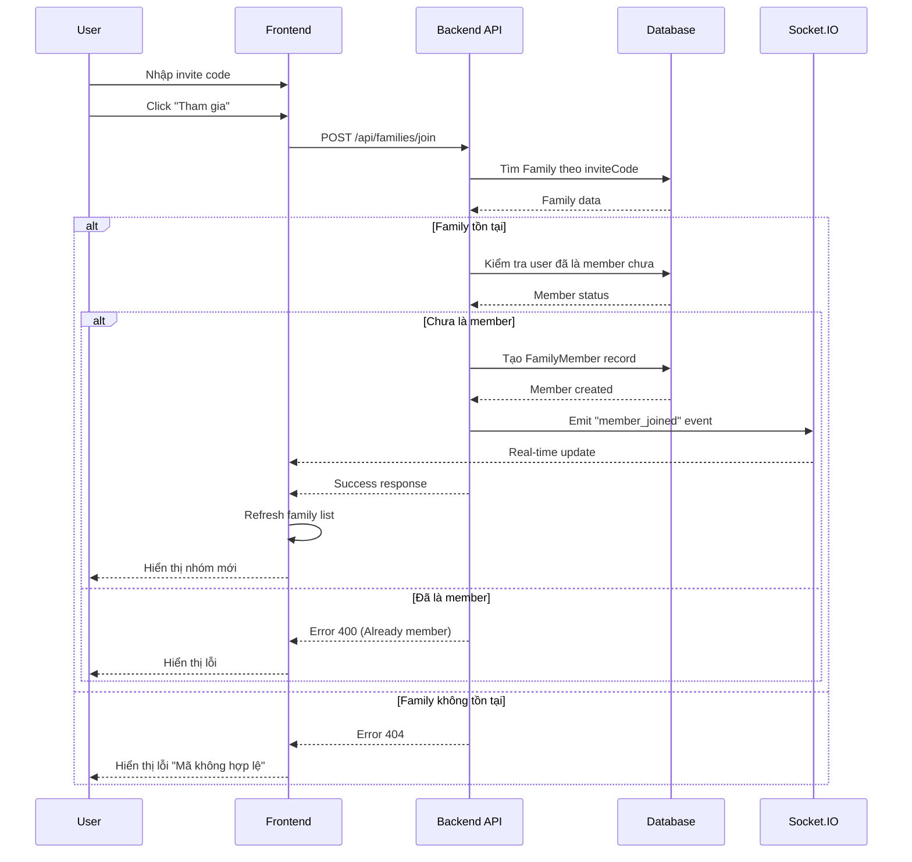
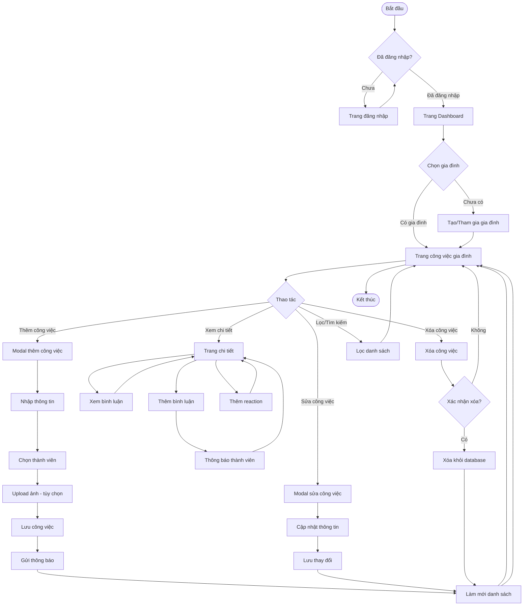

# BÁO CÁO ĐỒ ÁN
## ỨNG DỤNG QUẢN LÝ CÔNG VIỆC GIA ĐÌNH (FAMILY TODOAPP)

**Sinh viên thực hiện:** [Tên sinh viên]  
**Mã số sinh viên:** [MSSV]  
**Lớp:** [Lớp]  
**Giảng viên hướng dẫn:** [Tên GVHD]  
**Ngày hoàn thành:** 24/12/2025

---

## MỤC LỤC

1. [Tổng quan dự án](#1-tổng-quan-dự-án)
2. [Phân tích yêu cầu](#2-phân-tích-yêu-cầu)
3. [Thiết kế hệ thống](#3-thiết-kế-hệ-thống)
4. [Công nghệ sử dụng](#4-công-nghệ-sử-dụng)
5. [Kiến trúc hệ thống](#5-kiến-trúc-hệ-thống)
6. [Cài đặt và triển khai](#6-cài-đặt-và-triển-khai)
7. [Kết quả và đánh giá](#7-kết-quả-và-đánh-giá)
8. [Kết luận và hướng phát triển](#8-kết-luận-và-hướng-phát-triển)

---

## 1. TỔNG QUAN DỰ ÁN

### 1.1. Giới thiệu

**Family TodoApp** là một ứng dụng web quản lý công việc gia đình, cho phép các thành viên trong gia đình tạo, theo dõi và quản lý công việc chung một cách hiệu quả. Ứng dụng hỗ trợ phân công nhiệm vụ, theo dõi tiến độ, tương tác giữa các thành viên và thông báo real-time.

### 1.2. Mục tiêu dự án

- Xây dựng hệ thống quản lý công việc gia đình hiện đại, dễ sử dụng
- Hỗ trợ nhiều thành viên cùng làm việc trên một nhóm công việc
- Cung cấp giao diện đẹp, responsive, hỗ trợ dark/light mode
- Hỗ trợ đa ngôn ngữ (Tiếng Việt/English)
- Tích hợp real-time notifications
- Hỗ trợ đăng nhập bằng social media (Facebook, Google)

### 1.3. Phạm vi dự án

**Frontend:**
- Web application (React + Vite)
- Mobile application (React Native - tùy chọn)

**Backend:**
- RESTful API (Node.js + Express)
- Real-time communication (Socket.IO)
- Database (PostgreSQL)

**Deployment:**
- Frontend: Vercel
- Backend: Railway/Render
- Database: PostgreSQL (Cloud)

---

## 2. PHÂN TÍCH YÊU CẦU

### 2.1. Yêu cầu chức năng

#### 2.1.1. Quản lý người dùng
- Đăng ký/Đăng nhập tài khoản
- Đăng nhập bằng Facebook/Google
- Quản lý thông tin cá nhân (tên, email, avatar)
- Đổi mật khẩu

#### 2.1.2. Quản lý gia đình
- Tạo nhóm gia đình mới
- Tham gia nhóm bằng invite code hoặc link
- Quản lý thành viên (mời, xóa, phân quyền)
- Phân quyền: Owner, Admin, Member

#### 2.1.3. Quản lý công việc
- Tạo, chỉnh sửa, xóa công việc
- Gán công việc cho thành viên
- Phân loại theo độ ưu tiên (Cao, Trung bình, Thấp, Cực cao)
- Theo dõi trạng thái (Chưa làm, Đang làm, Hoàn thành)
- Đặt deadline và lịch trình
- Upload hình ảnh đính kèm
- Tìm kiếm và lọc công việc
- Xem công việc cá nhân và công việc gia đình

#### 2.1.4. Tương tác
- Bình luận trên công việc
- Phản ứng (reactions) với công việc/bình luận
- Thông báo real-time
- Xem tiến độ của từng thành viên

#### 2.1.5. Giao diện
- Dark/Light mode
- Đa ngôn ngữ (Tiếng Việt/English)
- Responsive design
- Pagination
- Real-time updates

### 2.2. Yêu cầu phi chức năng

- **Hiệu năng:** Response time < 2s, hỗ trợ pagination
- **Bảo mật:** JWT authentication, password hashing, CORS protection
- **Khả năng mở rộng:** Kiến trúc module, dễ thêm tính năng mới
- **Khả năng bảo trì:** Code clean, có documentation
- **Tương thích:** Hỗ trợ các trình duyệt hiện đại, responsive mobile

---

## 3. THIẾT KẾ HỆ THỐNG

### 3.1. Sơ đồ ERD (Entity Relationship Diagram)



### 3.2. Use Case Diagram



#### Đặc tả Use Case

**UC1: Đăng ký/Đăng nhập**
- **Actor:** User
- **Mô tả:** Người dùng đăng ký tài khoản mới hoặc đăng nhập vào hệ thống
- **Precondition:** Chưa đăng nhập
- **Main Flow:**
  1. User truy cập trang đăng nhập/đăng ký
  2. Nhập thông tin (email, password) hoặc chọn social login
  3. Hệ thống xác thực
  4. Chuyển đến trang Dashboard
- **Postcondition:** User đã đăng nhập thành công

**UC2: Quản lý thông tin cá nhân**
- **Actor:** User
- **Mô tả:** User cập nhật thông tin cá nhân (tên, email, avatar)
- **Precondition:** User đã đăng nhập
- **Main Flow:**
  1. User truy cập trang Settings
  2. Cập nhật thông tin
  3. Upload avatar (nếu có)
  4. Lưu thay đổi
- **Postcondition:** Thông tin đã được cập nhật

**UC3: Tạo/Tham gia gia đình**
- **Actor:** User
- **Mô tả:** User tạo nhóm gia đình mới hoặc tham gia nhóm bằng code/link
- **Precondition:** User đã đăng nhập
- **Main Flow:**
  1. User chọn "Tạo nhóm" hoặc "Tham gia nhóm"
  2. Nhập thông tin (tên nhóm hoặc invite code)
  3. Hệ thống tạo/thêm user vào nhóm
  4. Chuyển đến trang quản lý nhóm
- **Postcondition:** User đã tạo/tham gia nhóm thành công

**UC4: Quản lý công việc**
- **Actor:** User (Owner/Admin/Member)
- **Mô tả:** Tạo, chỉnh sửa, xóa, gán công việc
- **Precondition:** User đã tham gia ít nhất một nhóm
- **Main Flow:**
  1. User chọn nhóm gia đình
  2. Tạo công việc mới (nhập title, description, priority, dueDate, assignees)
  3. Upload hình ảnh (nếu có)
  4. Lưu công việc
  5. Hệ thống gửi thông báo cho assignees
- **Postcondition:** Công việc đã được tạo và thông báo đã gửi

**UC5: Xem tiến độ**
- **Actor:** User
- **Mô tả:** Xem thống kê và tiến độ công việc của các thành viên
- **Precondition:** User đã tham gia nhóm
- **Main Flow:**
  1. User truy cập trang "Tiến độ thành viên"
  2. Hệ thống hiển thị thống kê theo từng thành viên
  3. User có thể xem chi tiết công việc của từng thành viên
- **Postcondition:** User đã xem được thống kê

**UC6: Tương tác công việc**
- **Actor:** User
- **Mô tả:** Bình luận và phản ứng với công việc
- **Precondition:** User đã tham gia nhóm có công việc
- **Main Flow:**
  1. User mở chi tiết công việc
  2. Thêm bình luận hoặc reaction
  3. Hệ thống lưu và gửi thông báo
- **Postcondition:** Tương tác đã được lưu

**UC7: Xem thông báo**
- **Actor:** User
- **Mô tả:** Xem và quản lý thông báo real-time
- **Precondition:** User đã đăng nhập
- **Main Flow:**
  1. Hệ thống gửi thông báo khi có sự kiện mới
  2. User xem danh sách thông báo
  3. Đánh dấu đã đọc
- **Postcondition:** Thông báo đã được xem

**UC8: Quản lý thành viên**
- **Actor:** Owner/Admin
- **Mô tả:** Mời, xóa thành viên khỏi nhóm
- **Precondition:** User có quyền Owner/Admin
- **Main Flow:**
  1. Owner/Admin truy cập quản lý thành viên
  2. Mời thành viên mới (email hoặc link)
  3. Xóa thành viên (nếu cần)
- **Postcondition:** Thành viên đã được thêm/xóa

**UC9: Phân quyền**
- **Actor:** Owner
- **Mô tả:** Thay đổi vai trò của thành viên (Member ↔ Admin)
- **Precondition:** User có quyền Owner
- **Main Flow:**
  1. Owner chọn thành viên
  2. Thay đổi vai trò
  3. Lưu thay đổi
- **Postcondition:** Vai trò đã được cập nhật

### 3.3. Class Diagram



### 3.4. Sequence Diagram

#### 3.4.1. Sequence Diagram - Tạo công việc



#### 3.4.2. Sequence Diagram - Đăng nhập



#### 3.4.3. Sequence Diagram - Tham gia gia đình



### 3.5. Activity Diagram

#### 3.5.1. Activity Diagram - Quy trình quản lý công việc



---

## 4. CÔNG NGHỆ SỬ DỤNG

### 4.1. Frontend Web

| Công nghệ | Phiên bản | Mục đích |
|-----------|-----------|----------|
| React | 19.2.0 | UI library |
| Vite | 7.2.4 | Build tool & dev server |
| React Router | 7.11.0 | Client-side routing |
| TanStack Query | 5.90.12 | Data fetching & caching |
| Tailwind CSS | 4.1.18 | Utility-first CSS framework |
| Axios | 1.13.2 | HTTP client |
| Socket.IO Client | 4.8.1 | Real-time communication |

### 4.2. Backend

| Công nghệ | Phiên bản | Mục đích |
|-----------|-----------|----------|
| Node.js | >= 18.0.0 | Runtime environment |
| Express.js | 4.21.2 | Web framework |
| PostgreSQL | >= 14.x | Relational database |
| Prisma | 5.19.0 | ORM & database toolkit |
| Socket.IO | 4.8.1 | Real-time WebSocket |
| JWT | 9.0.2 | Authentication tokens |
| bcryptjs | 2.4.3 | Password hashing |
| Google Translate API | 9.2.1 | Translation service |

### 4.3. Mobile (Optional)

| Công nghệ | Phiên bản | Mục đích |
|-----------|-----------|----------|
| React Native | Latest | Mobile framework |
| Expo | Latest | Development platform |

### 4.4. Deployment

- **Frontend:** Vercel (Serverless)
- **Backend:** Railway/Render (Node.js hosting)
- **Database:** PostgreSQL (Cloud managed)

---

## 5. KIẾN TRÚC HỆ THỐNG

### 5.1. Kiến trúc tổng thể

```
┌─────────────────┐
│   Web Client    │  (React + Vite)
│   (Vercel)      │
└────────┬────────┘
         │ HTTPS/REST API
         │ WebSocket (Socket.IO)
         ▼
┌─────────────────┐
│  Backend API    │  (Node.js + Express)
│   (Railway)     │
└────────┬────────┘
         │ Prisma ORM
         ▼
┌─────────────────┐
│   PostgreSQL    │  (Cloud Database)
│    (Railway)    │
└─────────────────┘
```

### 5.2. Cấu trúc Backend

```
backend/
├── src/
│   ├── modules/          # Feature modules
│   │   ├── auth/         # Authentication
│   │   │   ├── routes.js
│   │   │   ├── service.js
│   │   │   └── middleware.js
│   │   ├── families/     # Family management
│   │   ├── tasks/        # Task management
│   │   ├── notifications/# Notifications
│   │   └── translation/  # Translation service
│   ├── middleware/       # Express middleware
│   │   ├── errorHandler.js
│   │   └── notFound.js
│   ├── utils/           # Utilities
│   │   ├── logger.js
│   │   └── response.js
│   ├── config/          # Configuration
│   └── server.js        # Main entry point
└── prisma/
    ├── schema.prisma    # Database schema
    └── migrations/      # Database migrations
```

### 5.3. Cấu trúc Frontend

```
web/
├── src/
│   ├── api/            # API client
│   ├── auth/           # Authentication context
│   ├── components/     # Reusable components
│   │   ├── tasks/      # Task-specific components
│   │   └── ...
│   ├── pages/          # Page components
│   ├── hooks/          # Custom React hooks
│   ├── services/       # API services
│   ├── utils/          # Utility functions
│   ├── language/       # i18n context
│   ├── theme/          # Theme context
│   └── realtime/       # Socket.IO client
└── public/             # Static assets
```

---

## 6. CÀI ĐẶT VÀ TRIỂN KHAI

### 6.1. Yêu cầu hệ thống

- **Node.js:** >= 18.0.0
- **npm:** >= 8.0.0
- **PostgreSQL:** >= 14.x
- **Git:** Để clone repository

### 6.2. Cài đặt Local

#### Bước 1: Clone repository
```bash
git clone <repository-url>
cd GR1-IT5021
```

#### Bước 2: Cài đặt Backend
```bash
cd backend
npm install
cp .env.example .env
# Chỉnh sửa .env với thông tin database
npx prisma migrate dev
npx prisma generate
npm run dev
```

#### Bước 3: Cài đặt Frontend
```bash
cd ../web
npm install
cp .env.example .env
# Chỉnh sửa .env với API URL
npm run dev
```

### 6.3. Triển khai Production

#### Frontend (Vercel)
1. Kết nối GitHub repository với Vercel
2. Cấu hình build settings:
   - Build Command: `npm run build`
   - Output Directory: `dist`
   - Install Command: `npm install`
3. Thêm Environment Variables:
   - `VITE_API_BASE`
   - `VITE_SOCKET_URL`
   - `VITE_FRONTEND_URL`
   - `VITE_FACEBOOK_APP_ID`
   - `VITE_GOOGLE_CLIENT_ID`

#### Backend (Railway/Render)
1. Kết nối GitHub repository
2. Cấu hình:
   - Root Directory: `backend`
   - Build Command: `npm install && npx prisma generate`
   - Start Command: `npm start`
3. Thêm Environment Variables:
   - `DATABASE_URL`
   - `JWT_SECRET`
   - `NODE_ENV=production`
   - `PORT`
   - `FACEBOOK_APP_ID`, `FACEBOOK_APP_SECRET`
   - `GOOGLE_CLIENT_ID`

#### Database (PostgreSQL)
- Sử dụng managed PostgreSQL từ Railway/Render
- Tự động chạy migrations khi deploy

---

## 7. KẾT QUẢ VÀ ĐÁNH GIÁ

### 7.1. Kết quả đạt được

#### 7.1.1. Chức năng đã hoàn thành
- ✅ Đăng ký/Đăng nhập (Email, Facebook, Google)
- ✅ Quản lý thông tin cá nhân (avatar, profile)
- ✅ Tạo và quản lý nhóm gia đình
- ✅ Tham gia nhóm bằng code/link
- ✅ Phân quyền thành viên (Owner/Admin/Member)
- ✅ Tạo, sửa, xóa công việc
- ✅ Gán công việc cho thành viên
- ✅ Phân loại theo độ ưu tiên và trạng thái
- ✅ Upload hình ảnh đính kèm
- ✅ Tìm kiếm và lọc công việc
- ✅ Bình luận và phản ứng
- ✅ Thông báo real-time
- ✅ Xem tiến độ thành viên
- ✅ Dark/Light mode
- ✅ Đa ngôn ngữ (Vi/En)
- ✅ Pagination
- ✅ Responsive design

#### 7.1.2. Chất lượng code
- ✅ Code clean, dễ đọc
- ✅ Sử dụng utils và components tái sử dụng
- ✅ Error handling đầy đủ
- ✅ Security best practices
- ✅ Không có dead code
- ✅ Build thành công, không có lỗi

#### 7.1.3. Performance
- ✅ Bundle size: 522KB (151KB gzipped)
- ✅ Build time: ~2-4s
- ✅ API response time: < 2s
- ✅ Real-time updates: < 1s

### 7.2. Đánh giá

#### Điểm mạnh
1. **Kiến trúc rõ ràng:** Module-based, dễ mở rộng
2. **Code quality:** Clean code, DRY principle
3. **User experience:** Giao diện đẹp, responsive, dark mode
4. **Security:** JWT, password hashing, CORS protection
5. **Real-time:** Socket.IO cho notifications
6. **Đa ngôn ngữ:** Hỗ trợ Vi/En với translation API

#### Hạn chế
1. **Bundle size:** Có thể tối ưu thêm với code splitting
2. **Testing:** Chưa có unit tests đầy đủ
3. **Documentation:** Có thể bổ sung API documentation chi tiết hơn

#### Cải tiến đã thực hiện
1. ✅ Refactor code để loại bỏ duplication
2. ✅ Centralized utilities và constants
3. ✅ Reusable components (TaskImage, TaskBadge)
4. ✅ Production-ready (console.log wrapped, error handling)
5. ✅ Pagination cho tất cả danh sách
6. ✅ Security improvements (timeout, CORS)

---

## 8. KẾT LUẬN VÀ HƯỚNG PHÁT TRIỂN

### 8.1. Kết luận

Dự án **Family TodoApp** đã được hoàn thành với đầy đủ các tính năng cốt lõi:
- Quản lý công việc gia đình hiệu quả
- Giao diện hiện đại, dễ sử dụng
- Hỗ trợ real-time collaboration
- Đa nền tảng (Web, Mobile)
- Sẵn sàng deploy production

Ứng dụng đáp ứng được yêu cầu của một hệ thống quản lý công việc gia đình hiện đại, với khả năng mở rộng và bảo trì dễ dàng.

### 8.2. Hướng phát triển

#### Ngắn hạn
- [ ] Thêm unit tests và integration tests
- [ ] Tối ưu bundle size với code splitting
- [ ] Thêm error tracking (Sentry)
- [ ] Cải thiện SEO cho web app

#### Trung hạn
- [ ] Thêm tính năng lịch (Calendar view)
- [ ] Thêm tính năng nhắc nhở (Email/SMS)
- [ ] Thêm tính năng template công việc
- [ ] Thêm tính năng báo cáo và analytics

#### Dài hạn
- [ ] Mobile app hoàn chỉnh (React Native)
- [ ] Thêm tính năng chat giữa thành viên
- [ ] Thêm tính năng file sharing
- [ ] Thêm tính năng video call
- [ ] AI suggestions cho công việc

---

## PHỤ LỤC

### A. API Endpoints Chi Tiết

#### Authentication
- `POST /api/auth/register` - Đăng ký
- `POST /api/auth/login` - Đăng nhập
- `POST /api/auth/facebook` - Facebook login
- `POST /api/auth/google` - Google login
- `GET /api/auth/me` - Lấy thông tin user
- `PUT /api/auth/me` - Cập nhật profile
- `PUT /api/auth/change-password` - Đổi mật khẩu

#### Families
- `GET /api/families` - Danh sách families
- `POST /api/families` - Tạo family
- `GET /api/families/:id` - Chi tiết family
- `POST /api/families/join` - Tham gia bằng code
- `POST /api/families/:id/invite` - Mời thành viên
- `GET /api/families/:id/tasks` - Tasks của family

#### Tasks
- `GET /api/tasks/my` - Tasks của user
- `POST /api/tasks` - Tạo task
- `GET /api/tasks/:id` - Chi tiết task
- `PUT /api/tasks/:id` - Cập nhật task
- `DELETE /api/tasks/:id` - Xóa task
- `PATCH /api/tasks/:id/status` - Đổi trạng thái

#### Notifications
- `GET /api/notifications` - Danh sách notifications
- `PATCH /api/notifications/:id/read` - Đánh dấu đã đọc

#### Translation
- `POST /api/translate` - Dịch text
- `POST /api/translate/batch` - Dịch batch
- `GET /api/translate/health` - Health check

### B. Database Schema Chi Tiết

Xem file `backend/prisma/schema.prisma` để biết chi tiết về:
- Các bảng và quan hệ
- Constraints và indexes
- Data types

### C. Environment Variables

#### Backend
```env
DATABASE_URL=postgresql://...
JWT_SECRET=your-secret-key
NODE_ENV=production
PORT=4000
FACEBOOK_APP_ID=...
FACEBOOK_APP_SECRET=...
GOOGLE_CLIENT_ID=...
ALLOWED_ORIGINS=https://your-frontend.vercel.app
```

#### Frontend
```env
VITE_API_BASE=https://your-backend.railway.app/api
VITE_SOCKET_URL=https://your-backend.railway.app
VITE_FRONTEND_URL=https://your-app.vercel.app
VITE_FACEBOOK_APP_ID=...
VITE_GOOGLE_CLIENT_ID=...
```

---

## TÀI LIỆU THAM KHẢO

1. React Documentation - https://react.dev
2. Express.js Guide - https://expressjs.com
3. Prisma Documentation - https://www.prisma.io/docs
4. Socket.IO Documentation - https://socket.io/docs
5. Tailwind CSS Documentation - https://tailwindcss.com/docs
6. Vercel Deployment Guide - https://vercel.com/docs
7. Railway Documentation - https://docs.railway.app

---

**Ngày hoàn thành:** 24/12/2025  
**Phiên bản:** 1.0.0  
**Trạng thái:** ✅ Production Ready
